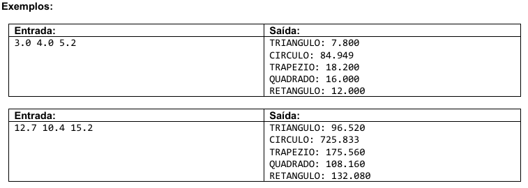

##  Fazer um programa que leia três valores com ponto flutuante de dupla precisão: A, B e C. Em seguida, calcule e mostre:  

a) a área do triângulo retângulo que tem A por base e C por altura.  
b) a área do círculo de raio C. (pi = 3.14159)  
c) a área do trapézio que tem A e B por bases e C por altura.  
d) a área do quadrado que tem lado B.  
e) a área do retângulo que tem lados A e B.

##

